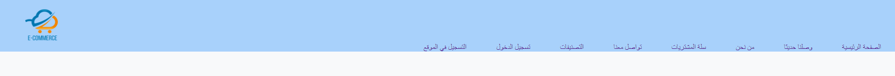
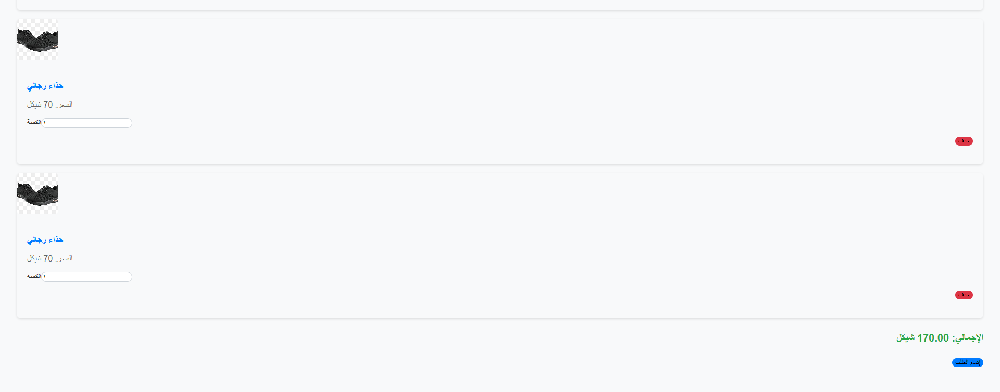
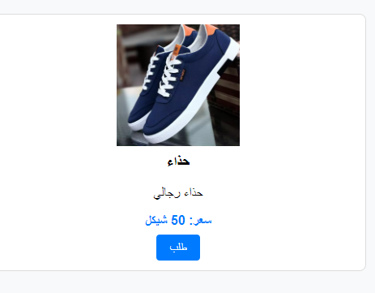
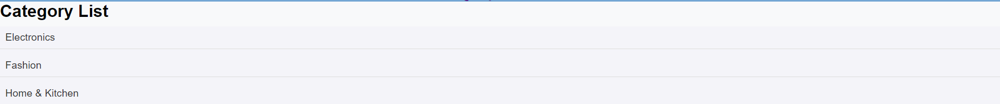
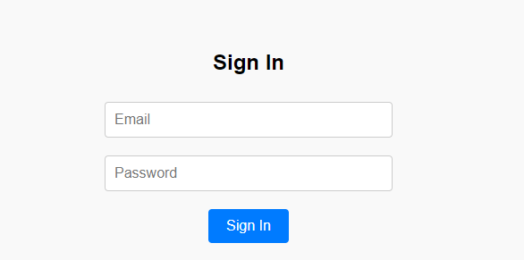
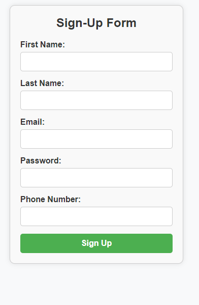

# team2
# E-Commerce Website

This is an e-commerce website project featuring various components built using different technologies. The project includes a navbar, shopping ,footer,cart, card components, a list of categories, and authentication functionalities.

## Project Overview

This project is an e-commerce website that allows users to browse products, manage their shopping cart, and authenticate through login and sign-up functionalities. The site features a responsive design and integrates multiple technologies to deliver a seamless user experience.

## Technologies Used

- **React**: For building the Navbar, Shopping Cart, and Card components,homepage.
- **Vue**: For displaying the slider.
- **Lit** ,**Node.js**: For the Login and Sign-Up components and List of Categories.
-**vite** : for integration

## Components

### Navbar 

The navbar is built using React and provides navigation throughout the website. It includes links to different sections of the site and is responsive.
screenshot :

### Footer : 
screenshot :


### Shopping Cart 


The shopping cart component, created with React, allows users to add, remove, and view items in their cart. It also handles quantity adjustments and displays the total price.
screenshot : 

### Card Component

The card component, built with React, is used to display product information in a visually appealing way. Each card includes product details and an option to add the product to the cart.
screenshot :


### List of Categories

The list of categories is implemented using Lit and allows users to filter products based on different categories. It provides an organized view of available product categories.
i
screenshot :

### Login and Sign-Up

The login and sign-up components are created using Lit. They provide user authentication functionalities, including account creation and secure login.
screenshot :
screenshot :

### Homepage(slider and Background) 
This component is a mixture of React and View.
screenshot :

### Footer() :
vue.js
screenshot :

### Server() :
node.js
screenshot :

## Installation

To get started with this project, clone the repository and install the necessary dependencies:
```bash
git clone <repository-url>
cd <project-directory>
npm install
npm run dev;


##  to Run server : 
```bash
cd src
cd api
node server.js

## Demo

### Watch the demo of our e-commerce website

You can watch the demo video showcasing the features and UI of our e-commerce website by clicking the link below:

[Watch Demo (https://youtu.be/JdIUwMjHkUY)